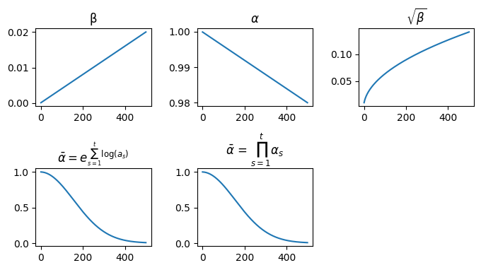
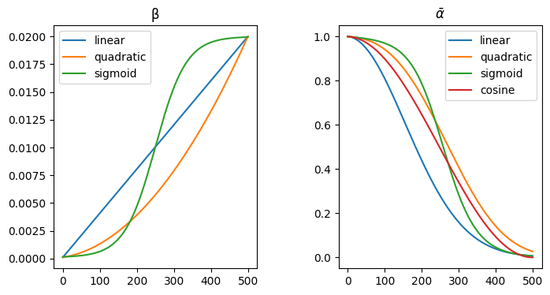
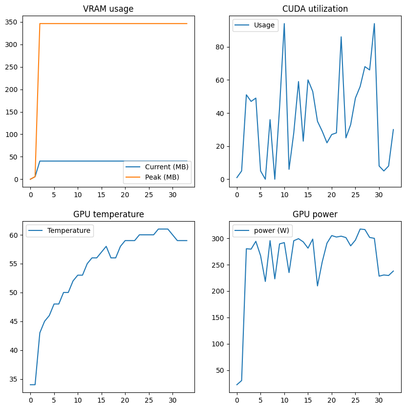
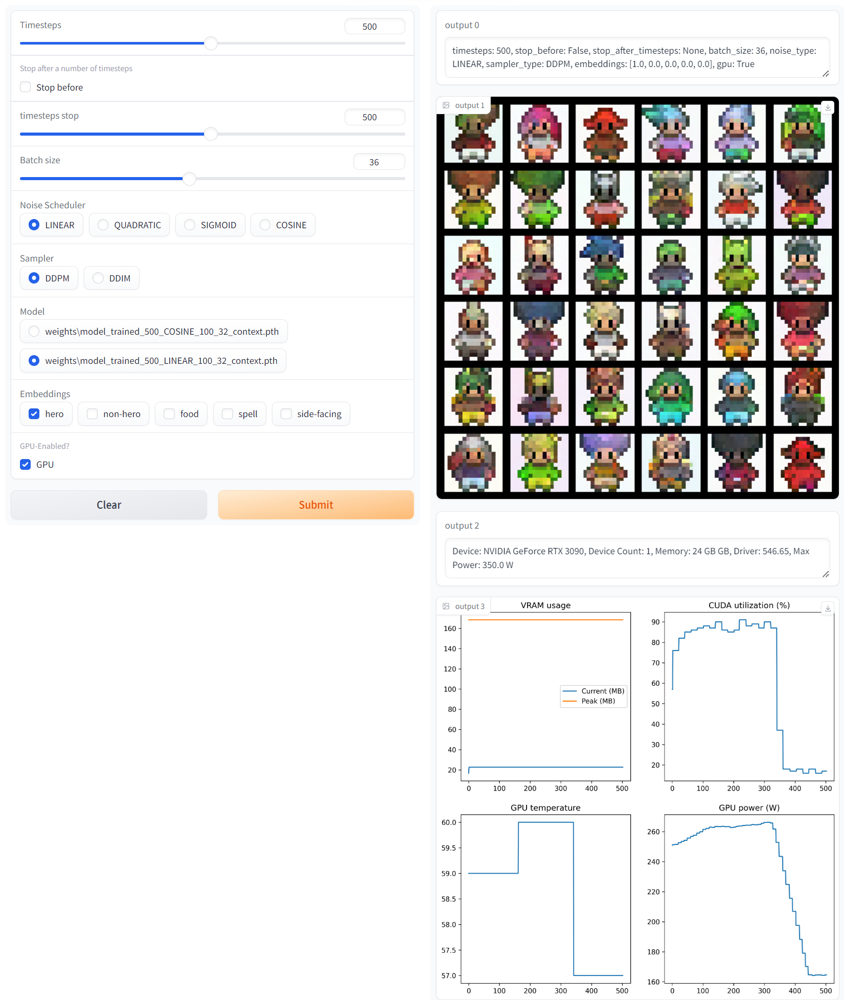
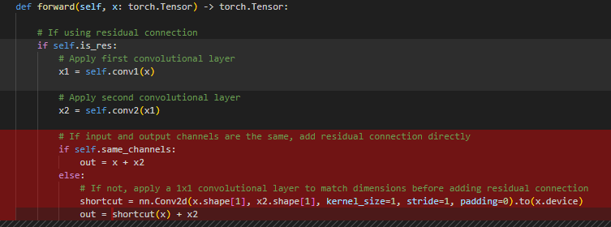

# Microdiffusion: Diffusion Models 101

Microdiffusion implements the basic of images diffusion. It implements both the training and sampling.In the example, it uses Sprites by ElvGames, [FrootsnVeggies](https://zrghr.itch.io/froots-and-veggies-culinary-pixels) and [kyrise](https://kyrise.itch.io/kyrises-free-16x16-rpg-icon-pack), that is packaged as Numpy muti-dimensional arrays.

The DDPM and DDIM sampling algorithms are based on the code and labs presented in Deeplearning AI's [How Diffusion Models Work](https://www.deeplearning.ai/short-courses/how-diffusion-models-work/) by Sharon Zhou. The code is available from Ryota Kawamura's [Github repo](https://github.com/Ryota-Kawamura/How-Diffusion-Models-Work). It is based from https://github.com/cloneofsimo/minDiffusion

This repository shows:


- [Microdiffusion: Diffusion Models 101](#microdiffusion-diffusion-models-101)
  - [An implementation of the first diffusion model (DDPM): Denoising Diffusion Probabilistic Models](#an-implementation-of-the-first-diffusion-model-ddpm-denoising-diffusion-probabilistic-models)
    - [Sampling](#sampling)
  - [how to implement the faster DDIM model: Denoising Diffusion Implicit Models](#how-to-implement-the-faster-ddim-model-denoising-diffusion-implicit-models)
  - [Test with different noise schedulers: Linear, Quadratic, Sigmoid and Cosine.](#test-with-different-noise-schedulers-linear-quadratic-sigmoid-and-cosine)
  - [A simple example of what can be done using the awesome einops library for tensor operations.](#a-simple-example-of-what-can-be-done-using-the-awesome-einops-library-for-tensor-operations)
  - [A simple data augmentation technique for training using Torchvision's transforms](#a-simple-data-augmentation-technique-for-training-using-torchvisions-transforms)
  - [The Unet implementation is from the course, I found some nice educational material](#the-unet-implementation-is-from-the-course-i-found-some-nice-educational-material)
  - [How to get GPU Performance using Pytorch API and Pynvml libraries.](#how-to-get-gpu-performance-using-pytorch-api-and-pynvml-libraries)
  - [how to build an web interface for the sampling using Gradio.](#how-to-build-an-web-interface-for-the-sampling-using-gradio)
  - [How to convert the pytorch model to ONNX (https://onnx.ai/)](#how-to-convert-the-pytorch-model-to-onnx-httpsonnxai)
- [Next steps:](#next-steps)


## An implementation of the first diffusion model (DDPM): [Denoising Diffusion Probabilistic Models](https://arxiv.org/abs/2006.11239) 

### Sampling

1. $\mathbf{x}_T \sim \mathcal{N}(\mathbf{0}, \mathbf{I})$

2. for $t=T, \ldots, 1$ do

3. $\mathbf{z} \sim \mathcal{N}(\mathbf{0}, \mathbf{I})$ if $t>1$, else $\mathbf{z}=\mathbf{0}$

4. $\mathbf{x}_{t-1}=\frac{1}{\sqrt{\alpha_t}}\left(\mathbf{x}_t-\frac{1-\alpha_t}{\sqrt{1-\bar{\alpha}_t}} \mathbf{z}_\theta\left(\mathbf{x}_t, t\right)\right)+\sigma_t \mathbf{z}$, noise added back is $\sigma_t \times z = \sqrt{\beta_t} \times z$, predicted noise is $\mathbf{z}_\theta$

5. end for

6. return $x_0$

## how to implement the faster DDIM model: [Denoising Diffusion Implicit Models](https://arxiv.org/abs/2010.02502)

## Test with different noise schedulers: Linear, Quadratic, Sigmoid and Cosine.

Linear scheduler



Improments to the original DDPM paper include a different learning rate scheduler. Noise from the linear scheduler is added too fast, which make it harder to learn the reverse process. The cosine scheduler adds noise slower



noise scheduler: cosine (https://betterprogramming.pub/diffusion-models-ddpms-ddims-and-classifier-free-guidance-e07b297b2869#0caf)

## A simple example of what can be done using the awesome [einops library](https://github.com/arogozhnikov/einops) for tensor operations.

```python
# https://github.com/arogozhnikov/einops/blob/master/docs/1-einops-basics.ipynb
a = einops.rearrange(sprites[:5], 'b h w c -> (b h) w c')
plt.imshow(a)
plt.axis('off')
```


## A simple data augmentation technique for training using [Torchvision's transforms](https://pytorch.org/vision/master/generated/torchvision.transforms.RandomHorizontalFlip.html)

In your custom DataSet, you can transform your data:

```python
        self.transform = T.Compose([
            T.RandomHorizontalFlip() if augment_horizontal_flip else nn.Identity(),
            T.ToTensor(),                # from [0,255] to range [0.0,1.0]
            T.Normalize((0.5,), (0.5,))  # range [-1,1]

        ])
```

## The Unet implementation is from the course, I found some nice educational material 

## How to get GPU Performance using [Pytorch API](https://pytorch.org/docs/master/generated/torch.cuda.memory_stats.html#torch.cuda.memory_stats) and [Pynvml](https://pypi.org/project/pynvml/) libraries.



## how to build an web interface for the sampling using [Gradio](https://www.gradio.app).

run the command line: `gradio src/gradiointerface.py`



## How to convert the pytorch model to ONNX (https://onnx.ai/)

The following code in the forward pass of the ResidualConvBlock model was having a control flow with an 'if":



This prevented the model from being converted to ONNX format. The ONNX converter (https://pytorch.org/tutorials//beginner/onnx/export_simple_model_to_onnx_tutorial.html) would complain about an unknown ONNX operator: aten::random. I tried to define it as a custom but it would not help. The error message was misleading!

Instead I compute the path for the model during the initialization, which works well.

As a next step, I also need to save the weigths and biases to the ONNX model.

# Next steps:

- use the ONNX model

- Classifier-Free Guidance

- Re-implement the functionnalities using Hugging Face's Diffuser library for DDPM, DDIM and Unet2D.
